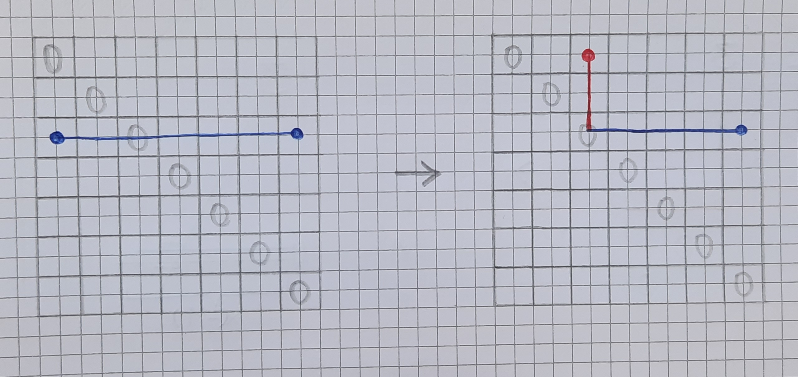
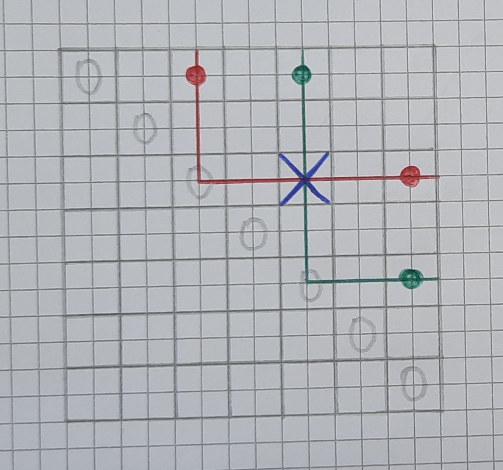
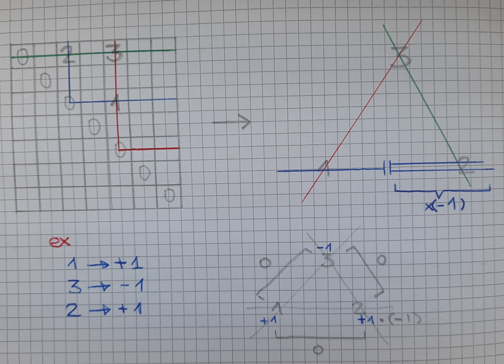
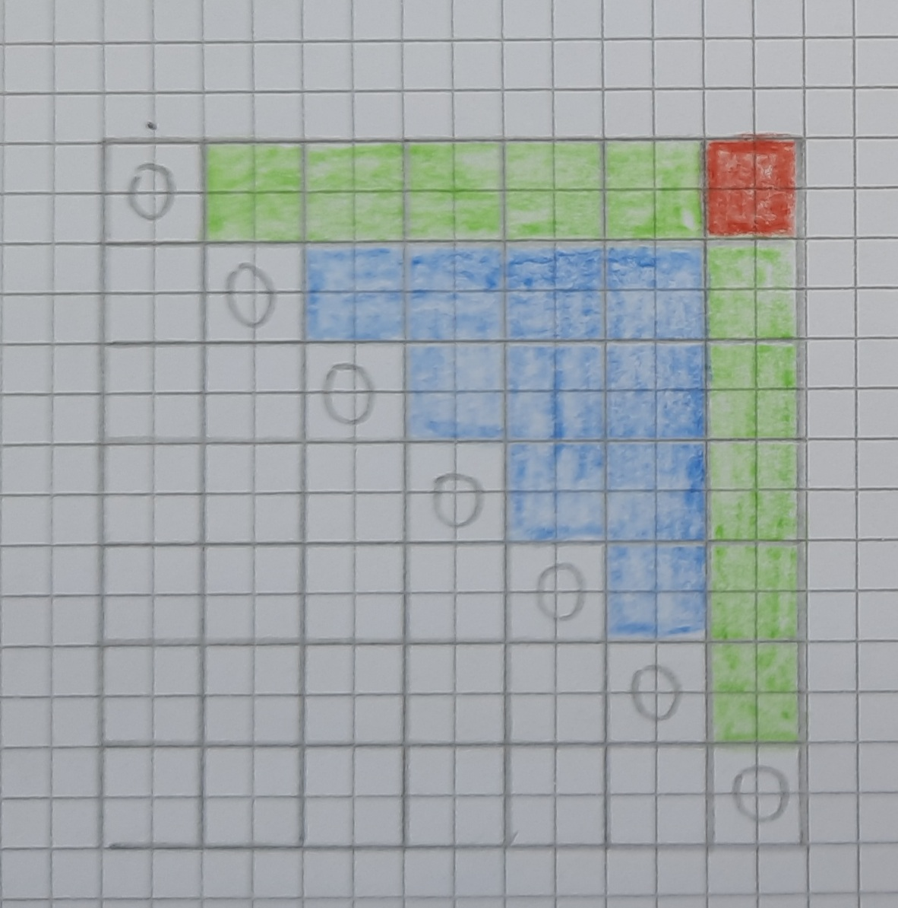
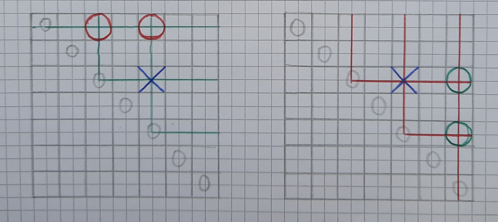
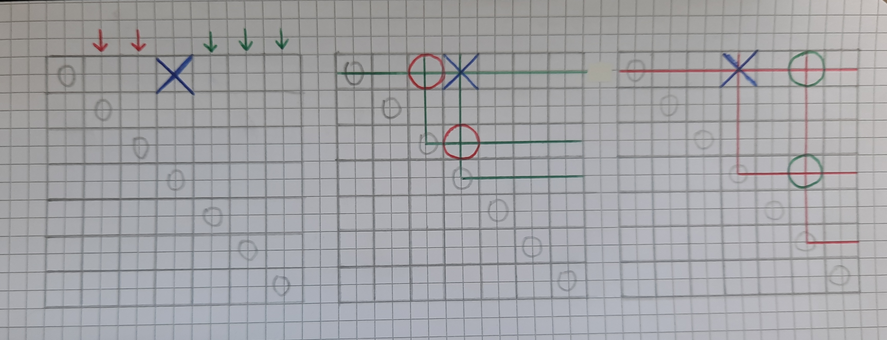

# PgAr2021_IJA_VAccinati_TamaGolem

## Spiegazione generazione grafo

### 1. Welcome to our TedTalk
Per generare il grafo siamo partiti dalla considerazione per cui una matrice in cui tutti gli elementi sono uguali a zero è teoricamente in equilibrio.
A questo punto avevamo allora bisogno di trovare un'operazione che modificasse qualcuno dei valori ed avesse la proprieta' di equilibrio come invariante.

Prima di illustrare il processo utilizzato e' necessario che capiate come tutti i "percorsi" possibili all'interno della matrice sono rappresentati nel triangolo superiore.

Il percorso in blu nell'immagine corrisponde a quello mezzo rosso e mezzo blu, dove gli elementi che giacciono sul tratto rosso sono moltiplicati per -1.

A questo punto possiamo affermare come per ciascun punto passino esattemente due percorsi.

Fatta questa premessa introduciamo la proprieta' che ci ha permesso di risolvere il problema.
Prendiamo 3 punti a caso nel triangolo superiore detti 1, 2 e 3 in modo tale che per questi punti passino solo 3 percorsi: A e B per 1, B e C per 2 ed A e C per 3.
Abbiamo cosi' creato un percorso chiuso, un triangolo i cui vertici sono gli elementi selezionati.
Come si puo' vedere in figura, modificando con criterio solo questi tre valori, i tre percorsi rimangono bilanciati.

Abbiamo cosi' trovato un modo per modificare liberamente e a piacimento i valori della matrice senza intaccare l'equilibrio.  
Sfruttando questa proprieta' possiamo generare il grafo.

### 2. Creazione triangolo
Per inizializzare in pratica la matrice selezioniamo allora casualmente un elemento nel triangolo superiore e da questo generiamo un triangolo di cui modificheremo i vertici.

La generazione dei triangoli avviene in maniera diversa in relazione a dove si trova nella matrice l'elemento estratto e i vari processi verrano spiegati in seguito.

N.B. Il quadrato rosso, ovvero l'angolo in alto a destra, potrebbe dare vita a veramente troppi triangoli, comportando una complicazione inutile e non aggiungendo nulla al programma; per questo motivo abbiamo deciso che non viene utilizzato come punto di partenza da cui generare un triamgolo, ma si passa semplicemente alla prossima casella casualmente estratta.

### 3. Elemento interno
Quando l'elemento estratto appartiene alla zona interna (BLU nell'immagine precedente, intitolata "divisione_zone_interne_esterne_angolo") possiamo individuare solamente due triangoli che lo hanno come vertice, come vedete nella seguente figura.

### 4. Elemento estreno
Quando l'elemento estratto appartiene alla zona interna (VERDE nell'immagine "divisione_zone_interne_esterne_angolo") potremmo formare numerosi triangoli che lo hanno come vertice.
Per non complicare troppo i controlli selezioniamo il secondo vertice del triangolo come uno degli elementi sulla stessa riga di quello estratto, in modo che il terzo risulti obbligato.

Qualora il secondo vertice selezionato si trovi a destra o a sinistra del primo la generazione del terzo e' leggermente diversa, come si vede in figura.

## Not flexing just sayin'

